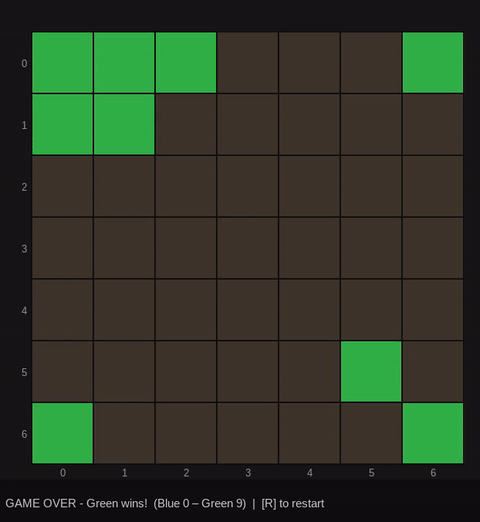

# T7G ML Gym

Board-game AI for two minigames from the Trilobyte games: *The 7th Guest* & *The 11th Hour*:

- **Microscope** — an Ataxx-like game on a 7×7 grid. Full AlphaZero-style
  self-play training pipeline plus fast C minimax engines to train and evaluate
  against.
- **The Beehive** — a hexagonal Ataxx variant on a 61-cell board, with a
  playable GUI and a C minimax opponent.



[Play in the browser](https://ashnasbot.github.io/t7g-ml/)

## History

The project started as a BFS solver hunting the optimal line to beat Stauf.
Microscope turns out to have a branching factor of 50–60 (chess is ~35), which
puts a full solve several billion years out of reach — so it quickly became a
heuristic-model problem. (A retrograde analysis may happen someday.)

`micro_3.c` traces back to Darkshoxx's
[Trilobyters](https://github.com/darkshoxx/Trilobyters): its `micro_2.py`
single-move solver was the precursor, which we ported to C and generalised into
a full find-best-move search. After several rounds of optimisation it is now a
reasonable engine to play against.

A lot of experimentation followed — PPO, action masking, much hair-pulling —
before the plan settled on an AlphaZero implementation, the current model.
Notable pieces:

- **C game core** - the engine and search are compiled C, scoped tightly to
  these games for speed.
- **Pooled inference** - many games run in parallel and their inferences are
  batched, in place of a separate inference server.
- **MCGS** - a Monte-Carlo *Graph* Search (transposition table + loop
  detection) rather than AlphaZero's trees, to exploit Microscope's many board
  symmetries.
- **Gumbel + Sequential Halving** - for root action selection.

---

## Microscope

### Installation

```bash
git clone <repository-url>
cd t7g-ml-gym

# Create and activate a virtual environment
python -m venv .venv
source .venv/bin/activate      # Linux / macOS
# .venv\Scripts\activate       # Windows

# Install dependencies and this package (editable)
pip install -r requirements.txt
pip install -e .
```

> **PyTorch**: the above installs the CPU build. For GPU training see the
> PyTorch section in [requirements.txt](requirements.txt) for the ROCm and CUDA
> variants.

### Build the C engines

The minimax solvers and the MCTS graph search are compiled C extensions. Build
them once after checkout, windows and linux supported, including cross-compiling with mingw:

```bash
make dll
```

This compiles `micro3`, `micro4`, `micro_mcts`, `micro_mcts_heuristic`, and
`beehive4` into `lib/`. `make dll-native` rebuilds with `-march=native` into
`build/`, which is loaded in preference to `lib/` when present;
`make dll-windows` cross-compiles with mingw-w64. `make clean` removes all build
output — the C libraries, the wasm modules, and `public/`.


### Training

Train a multi-head network via AlphaZero-style MCTS self-play:

```bash
python scripts/train_mcts.py
```

Checkpoints are saved to `models/mcts/` every iteration. Resume with
`--checkpoint models/mcts/iter_0050.pt`. Set `--checkpoint-dir` per run — a new
run otherwise overwrites the previous run's history.

| Flag | Default | Description |
|---|---|---|
| `--checkpoint` | – | Resume from a saved checkpoint |
| `--checkpoint-dir` | `models/mcts` | Where `iter_*.pt` / `promoted_*.pt` / `final.pt` go |
| `--iterations` | 500 | Self-play → train iterations |
| `--games` | 1200 | Self-play games for iteration 1; later iterations adapt towards `--target-examples` |
| `--target-examples` | 120000 | Examples per iteration the adaptive game count aims for |
| `--simulations` | 500 | MCTS simulations per move (`T7G_SIMULATIONS`) |
| `--pool` | 512 | Concurrent self-play games / inference batch size (`T7G_POOL_SIZE`) |
| `--pcr-fast-sims` | 100 | Playout-cap randomisation: sim budget for the cheap search that plays most moves |
| `--blend-alpha` | 0.25 | Value-target blend; 1.0 = pure game outcome, lower mixes in gated root-Q |
| `--lr` | 1e-4 | Learning rate (constant for the run) |
| `--arch` | `net2` | Network architecture (`net2` or `old`) |
| `--logdir` | `tblog/mcts` | TensorBoard log directory |
| `--cudagraphs` | off | CUDA/HIP graph capture for inference; unvalidated on ROCm |

Monitor with `tensorboard --logdir=tblog/`.

---

## The Beehive

Side-project to demonstrate generalisation of the approach.
A hexagonal Ataxx variant on a 61-cell board.
Play the GUI against the `beehive4` C minimax:

```bash
# Play against the minimax opponent
python scripts/play_beehive.py --opponent minimax --ai-time 2000

# Play as Red
python scripts/play_beehive.py --human-color red

# Practice against random moves
python scripts/play_beehive.py --opponent random
```

| Flag | Default | Description |
|---|---|---|
| `--opponent` | `minimax` | `minimax` or `random` |
| `--human-color` | `yellow` | Your colour (`yellow` or `red`) |
| `--ai-time` | 1000 | Minimax time budget per move (ms) |
| `--ai-delay` | 0.4 | Pause before the AI moves (s) |

Controls: click a piece then its destination (clone = 1 hex, jump = 2 hexes) ·
`E` toggles edit mode · `R` restarts · `Esc` quits.

---

## Running tests

```bash
python -m pytest tests/ -v
```

## Licensing

MIT, except `thirdparty/scummvm-cell/{cell.cpp,cell.h}` — ScummVM's Groovie
`CellGame`, the original game's Stauf AI — which is **GPLv3-or-later**.

`make pages` links `CellGame` into the webapp, so the published `public/`
bundle is GPLv3 (the target ships `LICENSE.GPLv3` and a source offer with it).
Everything else is MIT have fun :)

See [thirdparty/scummvm-cell/README.md](thirdparty/scummvm-cell/README.md).

## Acknowledgements

- The minimax solver began as a C port of `micro_2.py` from Darkshoxx's
  [Trilobyters](https://github.com/darkshoxx/Trilobyters) — thanks for the
  starting point.
- Stauf itself is [ScummVM](https://github.com/scummvm/scummvm)'s
  reimplementation of the original game's AI (`engines/groovie/logic/cell.cpp`),
  which both anchors this project's rating ladder and now plays you in the
  browser. See the licensing note above.
- Built with PyTorch
- Heavy use of AI - but the original ideas and engines are my own
